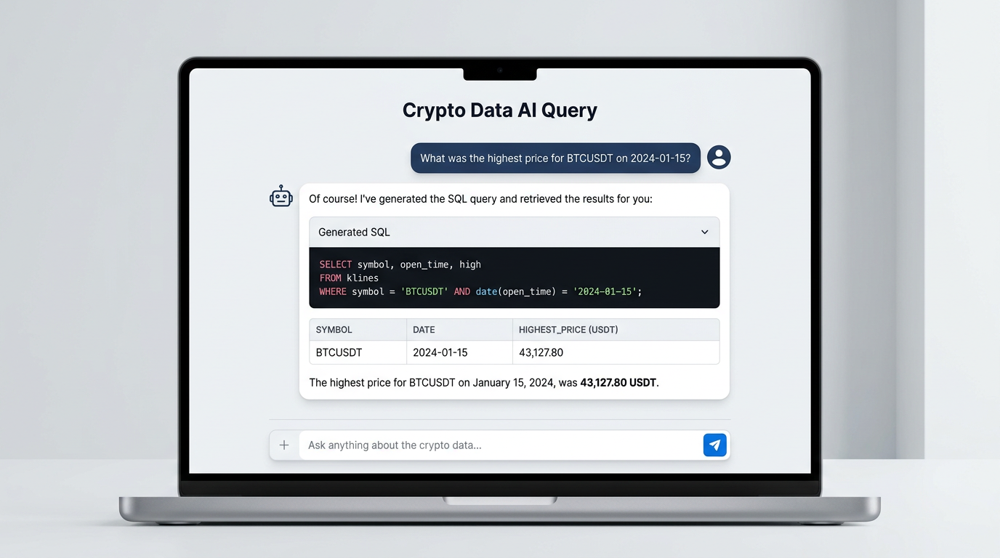

# Scalable Crypto Data Lakehouse

Production-grade Medallion Architecture data lakehouse for Binance Vision historical kline data. Built with Spark 3.5, Delta Lake, and Great Expectations, designed to run under modest resource constraints (default 4GB worker, 1GB executor; tunable via config).

## Architecture

```
Binance S3 → Ingest (aws-cli) → Raw CSV/ZIP
    → Bronze (Delta, partition by ingestion_date)
    → Silver (Dedupe, broadcast join, MERGE)
    → GX Validation
    → Gold (OHLCV, resolution follows source: 1s→1s, 1m→1m, 5m→5m; incremental MERGE, OPTIMIZE Z-ORDER)
```

### Medallion Layers

| Layer | Purpose | Partitioning |
|-------|---------|--------------|
| Bronze | Raw ingestion, minimal transform | `ingestion_date` |
| Silver | Deduplication, metadata join, MERGE | `symbol`, `date` |
| Gold | OHLCV (1s/1m/5m from source), incremental MERGE | `symbol`, `date` |

**Quality checks** — Silver data is validated (non-null timestamps/symbols, positive prices/volume) inside the Gold job before aggregation; no separate pipeline step.

### Key Design Decisions

**Partitioning (symbol + date)**

- Aligns with common query patterns (filter by symbol, date range)
- Keeps partition count manageable; avoids small-file problem

**Z-Order (timestamp only)**

- `OPTIMIZE ... ZORDER BY (timestamp)` improves predicate pushdown (partition columns like `symbol` cannot be Z-ordered)
- Run only on newly merged partitions to avoid full-table rewrites

**MERGE Idempotency**

- Silver: match on `(symbol, open_time)` — re-runs do not create duplicates
- Gold: match on `(symbol, timestamp)` — incremental load preserves target Z-ORDER

**Binance Vision timestamp format**

- Raw kline CSVs use `open_time` in **microseconds** (not milliseconds). Silver/Gold derive dates and windows from source resolution.

**History Server**

- Event logs: `http://localhost:18080`
- Debug slow stages, skew, spills via Spark UI

## Analysis: Silver vs Gold

### Silver Layer (`silver_klines`)

Silver holds **cleaned, deduplicated raw klines** at source resolution (1s, 1m, or 5m). It includes:

- **OHLCV + metadata**: `open`, `high`, `low`, `close`, `volume`, `num_trades`
- **Extra columns** (not in Gold): `coin_name`, `close_time`, `quote_asset_volume`, `taker_buy_base`, `taker_buy_quote`
- **Partitioning**: `symbol`, `date`

**When to use Silver:** When you need `quote_asset_volume`, `taker_buy_base`, `taker_buy_quote`, `coin_name`, or `close_time`. For standard OHLCV analytics, prefer Gold.

### Gold Layer (`gold_ohlcv`)

Gold holds **aggregated OHLCV** at the same resolution as Silver (1s→1s, 1m→1m, 5m→5m). It includes:

- **Analytics-ready schema**: `symbol`, `timestamp`, `open`, `high`, `low`, `close`, `volume`, `num_trades`, `date`
- **Optimized for queries**: Z-ordered by `timestamp`, partition pruning by `symbol` and `date`
- **Partitioning**: `symbol`, `date`

**When to use Gold:** For most analytics — price, volume, trades, candlestick analysis. Gold is the default for the Dashboard and AI Query.

| Need                          | Use   |
|-------------------------------|-------|
| OHLCV, volume, num_trades     | Gold  |
| quote_asset_volume            | Silver|
| taker_buy_base / taker_buy_quote | Silver |
| coin_name                     | Silver|
| close_time                    | Silver|

## Quick Start

### Prerequisites

- Docker & Docker Compose
- Python 3.10+ (for local dev)

### 1. Fetch Data

```bash
./scripts/fetch_data.sh
```

Optionally override defaults via environment variables, for example:

```bash
SYMBOL=BTCUSDT RESOLUTION=1m DATE_PATTERN=2024-01 ./scripts/fetch_data.sh
```

**1s ingestion** (for 2026):

1. Fetch 1s data: `RESOLUTION=1s DATE_PATTERN=2026 ./scripts/fetch_data.sh`
2. Run pipeline: `./scripts/run_pipeline.sh` — Gold follows source resolution (1s→1s, 1m→1m)
3. Dashboard presents detected resolution at `http://localhost:8501`

### 2. Start Spark Cluster

```bash
docker compose -f docker/docker-compose.yml up -d spark-master spark-worker history-server
```

### 3. Run Pipeline

#### Git Bash / WSL / Linux / macOS

```bash
./scripts/run_bronze.sh [YYYY-MM-DD] # Bronze only (optional ingestion_date; defaults to today)
./scripts/run_silver.sh [YYYY-MM-DD] # Silver only (optional ingestion_date)
./scripts/run_gold.sh   [YYYY-MM-DD] # Gold only (optional ingestion_date)

./scripts/run_pipeline.sh            # Bronze -> Silver -> Gold (incremental by default)
./scripts/run_pipeline.sh 2024-01-01 # Bronze, then Silver/Gold for a specific ingestion_date
```

#### PowerShell

```powershell
# Recommended: call the bash scripts via Git Bash (handles MSYS_NO_PATHCONV and Delta packages):
#   & "C:\Program Files\Git\bin\bash.exe" ./scripts/run_bronze.sh
#   & "C:\Program Files\Git\bin\bash.exe" ./scripts/run_silver.sh
#   & "C:\Program Files\Git\bin\bash.exe" ./scripts/run_gold.sh
#   & "C:\Program Files\Git\bin\bash.exe" ./scripts/run_pipeline.sh
```

Or run Bronze locally (without Docker) with:

```bash
PYTHONPATH=. python -m src.jobs.bronze_ingestion [YYYY-MM-DD]
```

### 4. View History Server

Open `http://localhost:18080` after job completion.

## Configuration

- **config/config.yaml** — Paths, Spark settings, GX checkpoint
- **.env** — Overrides (copy from `.env.example`)
- **.streamlit/config.toml** — Dashboard theme (dark sidebar, light main, dark code blocks)

### Spark Tuning (AQE & Memory)

- `spark.sql.adaptive.enabled=true` — AQE coalesces shuffle partitions at runtime.
- `spark.sql.shuffle.partitions=200` — High initial count; AQE reduces to optimal size.
- Default executor memory is `1g` (see `config/config.yaml` and `docker-compose.yml`); for larger full-history runs (especially Gold), you may want to:
  - Increase `spark.executor.memory` in `config/config.yaml` (for example `2g`–`4g`, depending on host RAM), **and**
  - Ensure `SPARK_WORKER_MEMORY` / container memory limits are set higher than executor memory.
- Alternatively, run Silver/Gold incrementally by passing an `ingestion_date` argument so they operate on the latest batch instead of the entire history, which reduces memory pressure.

## Dashboard


- **Start the dashboard** (after running at least one Gold job so the Gold table is populated):

```bash
docker compose -f docker/docker-compose.yml up -d dashboard
```

- **Access the UI** at `http://localhost:8501` — **Crypto Analytics Dashboard** with dark sidebar and light main content.

- **Metrics**: Symbol Price, Total Volume, 24h Price Change (formatted with $ and K/M/B suffixes).

- **Candlestick chart**: OHLCV candlesticks with volume bars below; timeframe selector (1m, 1H, 4H, 1D, 1W) for on-the-fly aggregation; current price indicator on the chart.

- **Filters**: symbol, date range (required before load), price range, min volume, and table sort order. **Download as CSV** to export filtered data.

- **Theme**: `.streamlit/config.toml` defines dark sidebar and light main area; mounted into the dashboard container via Docker Compose.

- **Memory-optimized loading** — Predicate pushdown on the Gold Delta table; symbols from `data/metadata/coin_metadata.csv`; data loaded only for selected symbol and date range (default: last 7 days). 30-day guardrail for 1s data.

### Manual Data Refresh

The sidebar provides two ways to refresh data:

1. **Quick Refresh (default)** — A prominent **Refresh Yesterday's Data** button runs the full pipeline for yesterday. Fast path for daily updates.
2. **Advanced: Manual Backfill** — An expander with a date picker to select any past date (up to yesterday) and run the pipeline for historical backfilling. Includes a warning that backfilling may take longer and consumes cluster resources.

Both paths run the same pipeline:

- **Fetch** — Downloads raw kline ZIPs from Binance public S3 (`s3://data.binance.vision`) via boto3 (no AWS credentials or Docker daemon required). Uses symbols from `coin_metadata.csv` and `RESOLUTION` env var (default `1m`).
- **Bronze → Silver → Gold** — Runs all Medallion stages in-process (local Spark). No `spark-submit` or cluster connection needed.

After a **successful** run, the cache is cleared so the Dashboard tab reflects the new data. Pipeline logs are available in a collapsible "View pipeline log" expander.

### AI Query (Natural Language to SQL)



The **Crypto Data AI Query** tab lets you ask questions in plain English; an LLM translates them into Spark SQL, executes against the Silver/Gold Delta tables, and explains the results.

- **Chat interface**: User messages in dark grey bubbles; assistant responses with intro, collapsible **Generated SQL** (dark code block), results table, and natural-language summary with bolded key values.
- **Requirements**: Add `OPENAI_API_KEY=sk-...` to `.env` at the project root. The dashboard mounts `.env` and loads it with `override=True`. Restart the dashboard after adding the key. Optional: `OPENAI_MODEL` (default: `gpt-4o-mini`).
- **Gold vs Silver**: Gold for analytics (OHLCV, volume, trades). Silver when you need `quote_asset_volume`, `taker_buy_base`, `taker_buy_quote`, `coin_name`, or `close_time`. Both share the same resolution (1s, 1m, or 5m; default 1m).
- **Example questions**: Expandable examples for Gold (price, volume, candles) and Silver (quote asset volume, taker buy, coin names).
- **Safety**: Only `SELECT` queries; `DROP`, `DELETE`, `UPDATE`, etc. blocked. `LIMIT 100` enforced; must filter by `symbol` and `date`.
- **Timestamp handling**: `open_time` (Silver) and `timestamp` (Gold) are in **microseconds** — use `FROM_UNIXTIME(col/1000000)` for human-readable output.

## Project Structure

```
/config          config.yaml
/.streamlit      config.toml (dashboard theme)
/docker          Dockerfile, docker-compose.yml
/src
  /jobs         bronze_ingestion, silver_transformation, gold_aggregations
  /dashboard    Streamlit app (OHLCV chart, AI Query tab, Manual Refresh)
  /utils        schemas, spark_session, config_loader, ai_query_helper, pipeline_orchestrator
  /quality      quality_checks, GX suites
/scripts        fetch_data.sh, cleanup_raw.sh, run_bronze.sh, run_pipeline.sh
/tests          conftest, test_transformations
/data           bronze, silver, gold, raw, spark-events
```

## Testing

```bash
pip install -r requirements.txt
pytest tests/ -v
```

## CI

`.github/workflows/basic_ci.yml` — Lint (ruff) and tests (pytest).
